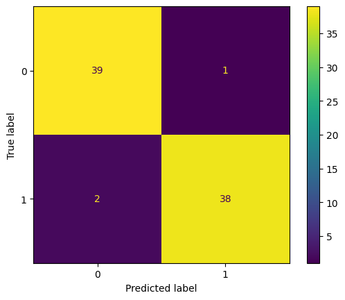
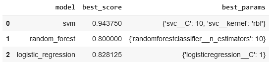
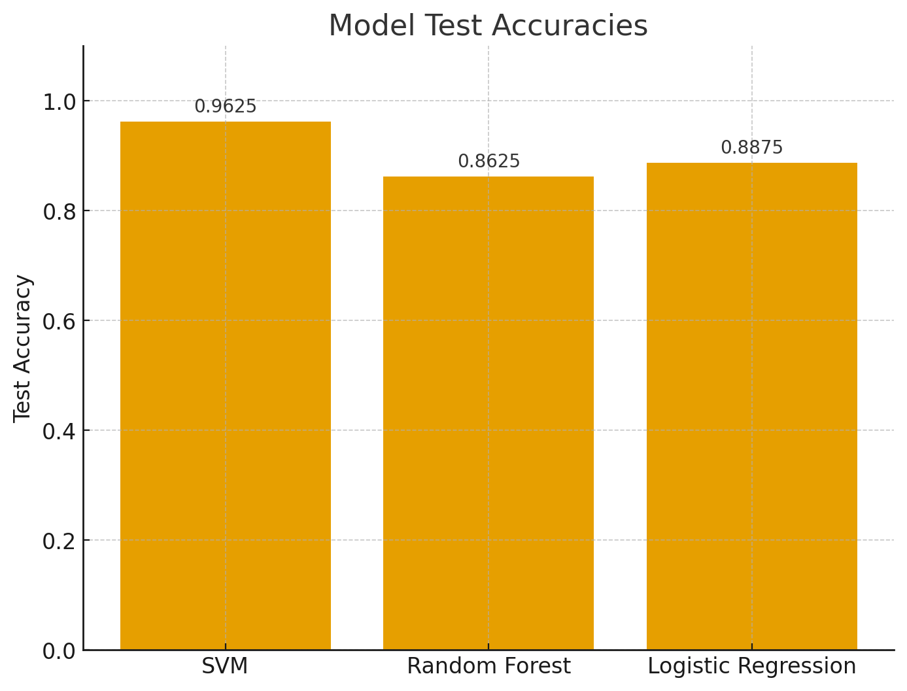

# 🎵 Audio Classifier

This project is a full-stack **Audio Classification App** that detects whether a given audio clip is **Human** or **AI-generated**.  
It uses a **FastAPI backend** for ML inference and a **React (Vite) frontend** for the user interface.  

🔗 **Live Demo**: [Audio Classifier on Render](https://audioclassificationfrontend.onrender.com/)

---

## 🚀 Features
- Upload an audio file (`.wav` supported).
- Classify audio as **Human** or **AI**.
- Play example human & AI audio samples.
- Clean UI with drag-and-drop support.
- Real-time classification with probability scores.
- Loading indicators while the backend processes the request.

---

## 🖼️ Model Statistics

- Confusion Matrix  

- Best Scores  

- Accuracy  

---

## 🛠️ Tech Stack
### Frontend
- React (Vite)
- TailwindCSS
- React Dropzone
- Lucide Icons

### Backend
- FastAPI
- Uvicorn
- Librosa (for audio feature extraction)
- NumPy / Pickle (for model handling)

---

## IMPORTANT NOTE - This project was made only for learning purposes and may not be able to give correct results. There were only 200 Real and 200 Fake Audio samples used for this project, however using more samples would have increased the accuracy. 
